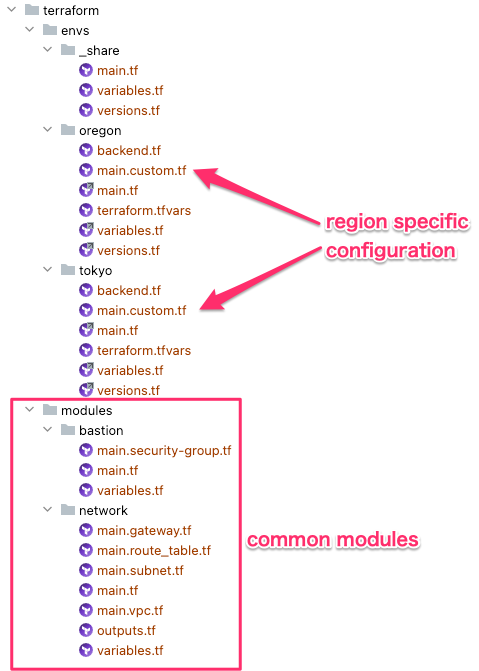
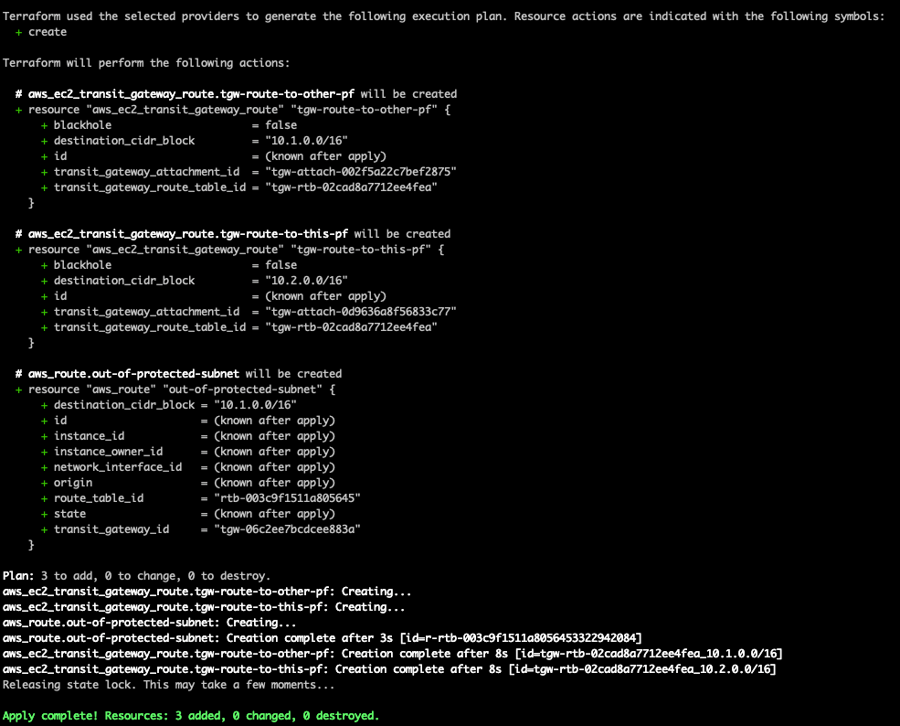

## AWS Inter-Region Transit Gateways Peering with Terraform

With microservices oriented architecture being more and more adopted,
it is very common to have services hosted in different platforms communicate with each other.

Communication between services usually does not need to travel over the public internet.
Hence, the importance of being able to interconnect them with private networks and reduce security threats such as DDoS attacks.

[AWS supports](https://aws.amazon.com/about-aws/whats-new/2019/12/aws-transit-gateway-supports-inter-region-peering/)
interconnection between 2 services hosted in 2 separate VPCs on different regions.
In this article we will walk you through that peering process.

### AWS Transit Gateway

AWS Transit Gateway can be defined as a cloud router that allows to interconnect networks through a central hub.

* Without TGW

  

* With TGW

  

*[images above are from AWS documentation](https://aws.amazon.com/transit-gateway)*

### Network architecture

We will connect 2 VPCs in 2 different regions. The first VPC is in Tokyo (Japan) and the second one is in Oregon (US).
These VPCs are of different AWS accounts, needless to say that this will work for 2 VPCs in the same account as well.

Below is a diagram of the interconnection infrastructure.


Each VPC is divided into 2 types of subnets. A public one with internet access and a protected one, which is isolated from the outside world.
We will lunch a bastion server into the public subnet and make it accessible via ssh from a specific IP.
We will also lunch a EC2 instance into the protected subnet and make it accessible via ssh only from the bastion server.
We will not use a [NAT gateway](https://docs.aws.amazon.com/vpc/latest/userguide/vpc-nat-gateway.html),
so there is no route from Tokyo Services Server to Oregon Services Server through the public internet.

### Terraform 

Our terraform folders are structured in a modular way to allow re-usability.
Transit gateway setup is slightly different depending on which side is initiating the peering, so we define it in a `main.custom.tf` file.



Transit Gateways peering will be done following steps below:

1. Create the underlying infrastructure components
    - VPC
    - Subnets
    - EC2 instances
    


2. Create Transit Gateways
```terraform
resource "aws_ec2_transit_gateway" "tgw" {
  description = "TGW to be peered with other AWS account"

  tags = {
    Name = "${var.env}-transit-gateway-${var.region}"
  }
}
```

3. Attach each VPC to it's corresponding transit gateway ([TGW VPC attachment](https://docs.aws.amazon.com/vpc/latest/tgw/tgw-vpc-attachments.html))
```terraform
resource "aws_ec2_transit_gateway_vpc_attachment" "attach-tgw-to-vpc" {
  transit_gateway_id = aws_ec2_transit_gateway.tgw.id

  vpc_id     = module.network.aws_vpc-vpc-id
  subnet_ids = module.network.aws_subnet-protected-ids

  transit_gateway_default_route_table_propagation = false
}
```

At this point, we can ssh into our protected instance and try to ping the other side.
Since peering is not done yet, no response is expected.


4. Peer the 2 transit gateways 👉 [Transit gateway peering attachments](https://docs.aws.amazon.com/vpc/latest/tgw/tgw-peering.html)
   
   One of the account has to create a peering attachment request and the other one has to accept it.
   In our example, Tokyo is making the peering attachment request.
```terraform
resource "aws_ec2_transit_gateway_peering_attachment" "request-peering" {
  peer_account_id         = var.other_side_tgw.account_id
  peer_region             = var.other_side_tgw.region
  peer_transit_gateway_id = var.other_side_tgw.id
  transit_gateway_id      = aws_ec2_transit_gateway.tgw.id
}
```


Then Oregon must accept the peering request.
```terraform
resource "aws_ec2_transit_gateway_peering_attachment_accepter" "accept-tgw-peering-request" {
  transit_gateway_attachment_id = var.other_side_tgw.peering_attachment_id
}
```

5. Setup necessary routes:
    - protected subnet route to the other side: for example, in Tokyo, requests sent to Oregon need be forwarded to the transit gateway
    - transit gateway route to the other side
    - transit gateway route to this side

*Tokyo routing


*Oregon routing



Pinging the other server should work at this point.


### Don't forget to destroy everything 💸


